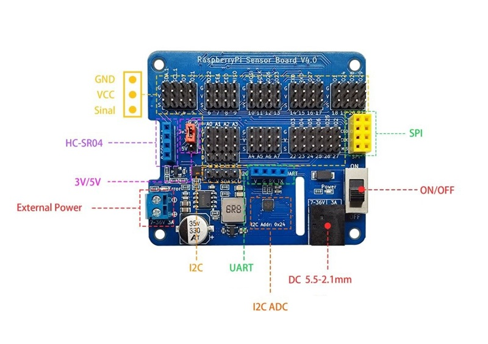
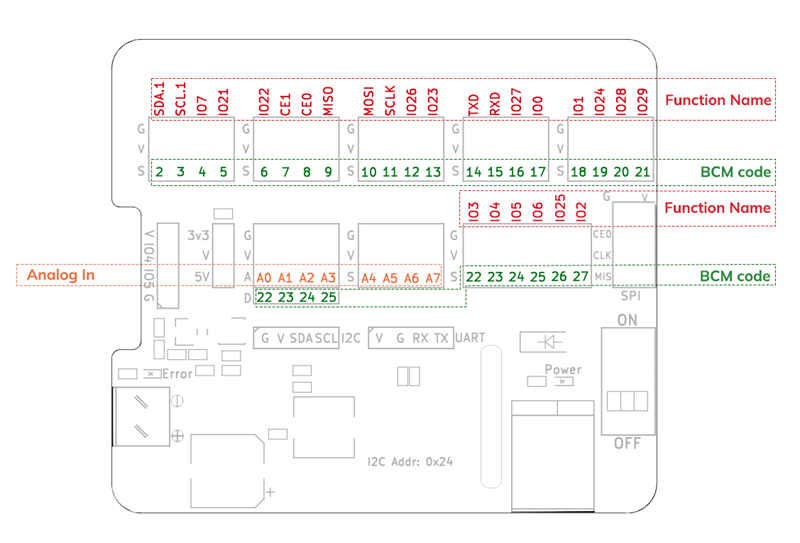
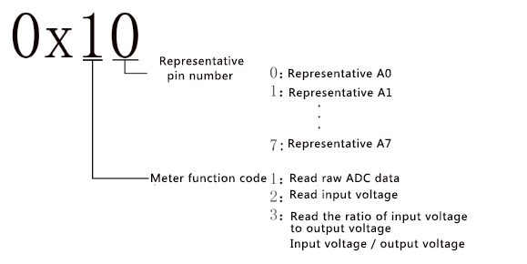
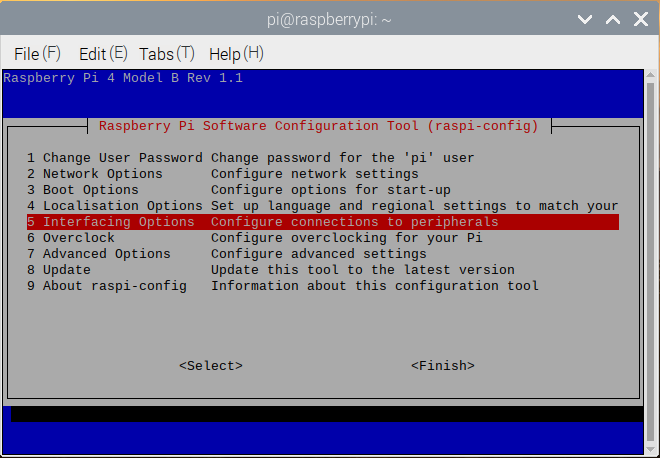
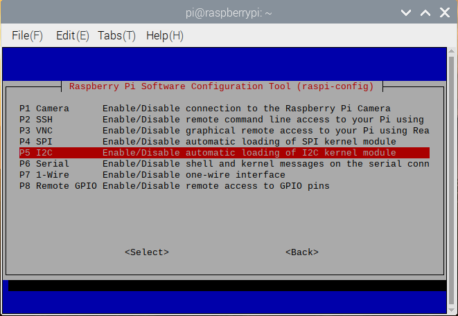
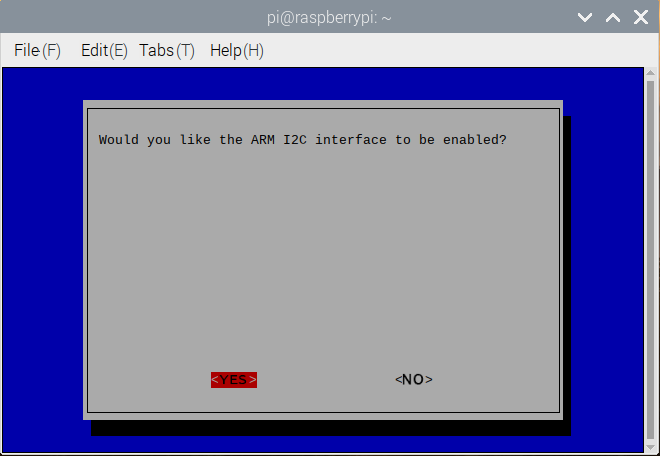
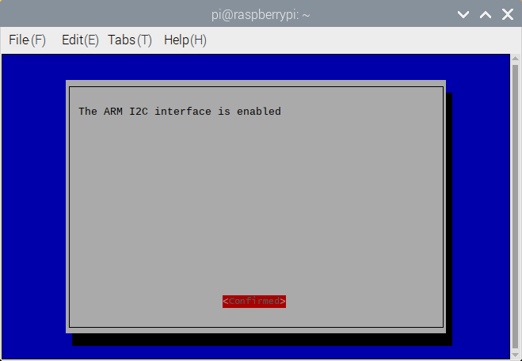
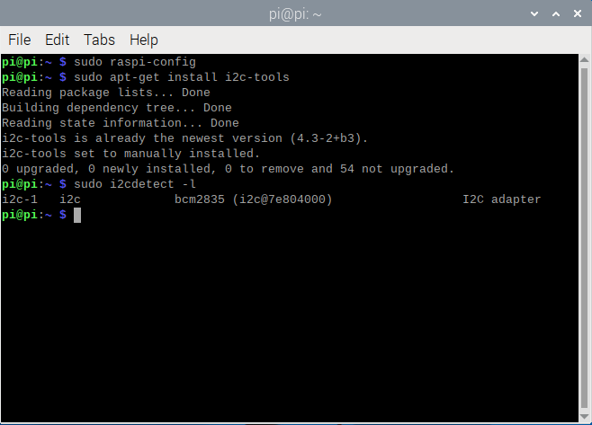
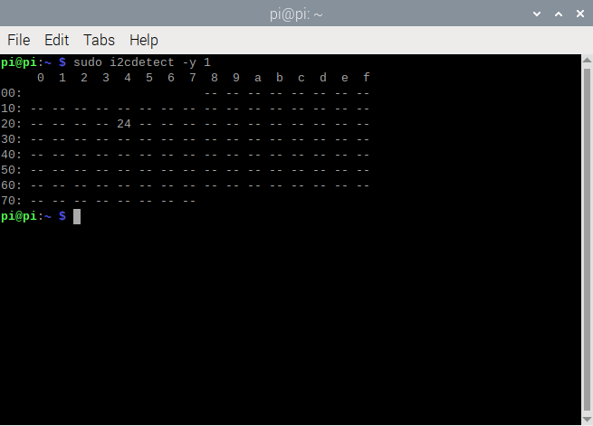

# RaspberryPi-Sensor-Board

​    The Raspberry Pi Sensor Expansion Board is designed specifically for the convenience of external sensors for Raspberry Pi. This expansion board is suitable for Raspberry Pi Zero/Zero W/Zero WH/A+/B+/2B/3B/3B+/4B. The Raspberry Pi can be powered through a 5.5-2.1mm DC head or terminal block. RF24L01 module, HC-SR04 ultrasonic module, I2C interface, UART interface are reserved, supporting 8 ADC channels. At the same time, free up the camera and display cable interface.



The Raspberry Pi expansion board is labeled with BCM codes and function names for signal pins, as shown in the following figure:



## Hardware schematic diagram

[schematic diagram](./RaspBerryPi_Sensor_Board.pdf)

## Feature

- Built-in 10bit ADC MCU， Support 8-channel ADC detection rang 0~1023;
- Support Raspberry Pi 2B/3B/3B+/4B/zero；
- 5.5x2.1mm DC head and terminal power supply，input rang 7 ~30V;
- Freely switch between external sensor voltage 3V3 and 5V;
- Onboard DC-DC step-down chip Voltage output: 5V 3A;
- * Enhanced Mainboard Protection: Equipped with an onboard 3.3V Short-Circuit Indicator (ERROR) that alerts you immediately to circuit faults, providing a critical layer of safety for your Raspberry Pi.

## MCU specifications

- Working voltage: 3.3V and 5V. Select the ADC detection voltage based on the jumper cap;

- Communication method with Raspberry Pi: I2C，speed 1~400K;

- IO: 8-channel ADC detection，pin name A0~A7;

- I2C address: 0x24，can redefine i2c address;

- 8-channel expansion mode supports ADC input, GPIO, PWM (PWM only A1-A2 supported)

## Register

        The MCU I2C address of the expansion board is 0x24, and the registered address is explained as follows:



- 0x10 ~ 0x17: read ADC raw data

- 0x20 ~ 0x27: read input voltage(mv)

- 0x30 ~ 0x37: read the ratio of input voltage to output voltage Input voltage / output voltage(0~100)

- 0x40 ~ 0x47: read or write pin A0-A7 digital value

- 0x51 ~ 0x52: set A1-A2 PWM duty

- 0x61 ~ 0x62: set A1-A2 PWM frequency

## Raspberry Pi I2C library installation

        Open the Raspberry Pi terminal and enter the "sudo raspi-config" command, then follow the sequence shown below.









        The above is to open the Raspberry Pi I2C. Next, we install the Raspberry I2C library and type "sudo apt-get install i2c-tools" in the terminal. After the input is complete, you can see that the I2C library is being downloaded. After the installation is complete, you can enter " sudo i2cdetect -l "detects whether the installation is correct. If a message similar to the following appears, the installation is normal.



        Enter "sudo i2cdetect -y 1" command in the terminal to scan all I2C devices connected to the I2C bus and print out the I2C bus address of the device, and the I2C address of our expansion board is 0x24.



Edit the config.txt file to set the Raspberry Pi IIC bus speed

```bash
sudo nano /boot/config.txt
```

Look for the line that contains "dtParam =i2c_arm=on" and add ", i2c_arm_baudrate=100000 "where 100000 is the new speed (100kbit /s), notice the comma before i2c. The complete code is as follows:

```bash
dtparam=i2c_arm=on,i2c_arm_baudrate=100000
```

This enables the I2C bus and also completes the new baud rate setup. When you're finished editing, use Ctrl-X, then Y, save the file and exit.
Restart Raspberry Pi to make the new Settings take effect:

```bash
sudo reboot
```

## Read ADC analog value

        As we all know, there is no ADC in Raspberry Pi, so the analog value of the sensor cannot be read directly. With the help of the ADC MCU built into the expansion board, a 10-bit ADC can be read. This means that analog sensors can be used on the Raspberry Pi, and there are a total of 8 available interfaces A0~A7.

### Python code

python version:  python3

run python demo before，please install smbus2 as cmd:

```bash
pi@raspberrypi: pip3 install smbus2 
```

```python
#coding=utf-8
from sensor_expansion_board_i2c import IoExpansionBoardI2c
from smbus2 import SMBus
import time

i2c_bus = 1
i2c_address = 0x24

io_expansion_board_i2c = IoExpansionBoardI2c(i2c_bus, i2c_address)

for i in range(8):
    io_expansion_board_i2c[i].mode = IoExpansionBoardI2c.ADC_MODE

try:
    while True:
        print('A0:',io_expansion_board_i2c[0].adc_value) 
        print('A1:',io_expansion_board_i2c[1].adc_value) 
        print('A2:',io_expansion_board_i2c[2].adc_value) 
        print('A3:',io_expansion_board_i2c[3].adc_value)
        print('A4:',io_expansion_board_i2c[4].adc_value)
        print('A5:',io_expansion_board_i2c[5].adc_value) 
        print('A6:',io_expansion_board_i2c[6].adc_value) 
        print('A7:',io_expansion_board_i2c[7].adc_value)
        time.sleep(1)
except KeyboardInterrupt:
    pass

```

Run the demo with Python3

```bash
pi@raspberrypi:~/$ python3 adc.py 
```

[**download python demo**](https://github.com/emakefun/RaspberryPi-Sensor-Board/releases/download/hw_4.0/sensor_expansion_board_python_demo.zip)

This routine is written in C++language for Raspberry Pi, with pin A0 outputting high and low levels at intervals of 100ms

```cpp
#include <iostream>
#include <chrono>
#include <thread>
#include "gpio_expansion_board.h"

GpioExpansionBoard gpio_expansion_board;

int main() {
    std::cout << "Setup" << std::endl;

    if (!gpio_expansion_board.SetGpioMode(GpioExpansionBoard::kGpioPinE0, 
                                        GpioExpansionBoard::kOutput)) {
        std::cerr << "Failed to set GPIO mode" << std::endl;
        return -1;
    }

    while (true) {
        std::cout << "Setting GPIO A0 to HIGH" << std::endl;
        if (!gpio_expansion_board.SetGpioLevel(GpioExpansionBoard::kGpioPinE0, 1)) {
            std::cerr << "Failed to set GPIO level HIGH" << std::endl;
            return -1;
        }

        std::this_thread::sleep_for(std::chrono::milliseconds(100));

        std::cout << "Setting GPIO A0 to LOW" << std::endl;
        if (!gpio_expansion_board.SetGpioLevel(GpioExpansionBoard::kGpioPinE0, 0)) {
            std::cerr << "Failed to set GPIO level LOW" << std::endl;
            return -1;
        }

        std::this_thread::sleep_for(std::chrono::milliseconds(100));
    }
    gpio_expansion_board.SetGpioLevel(GpioExpansionBoard::kGpioPinE0, 0);
    std::cout << "Program terminated" << std::endl;
    return 0;
}
```

use **g++** cmd build as follows

```bash
pi@raspberrypi:~/sensor_expansion_board_python_demo/src $
g++ -lwiringPi -I./ digital_output/digital_output.cpp gpio_expansion_board.cpp -o gpio_out
pi@raspberrypi:~/sensor_expansion_board_python_demo/src $./gpio_out
Setup
Setting GPIO A0 to HIGH
Setting GPIO A0 to LOW
Setting GPIO A0 to HIGH
Setting GPIO A0 to LOW
```

[**download cpp demo**](https://github.com/emakefun/RaspberryPi-Sensor-Board/releases/download/hw_4.0/sensor_expansion_board_cpp_demo.zip)
